# Aurelia Network

## Objetivo

Este projeto é uma implementação didática e **simulada** de uma blockchain básica, denominada Aurelia Network, criada como parte de uma atividade do programa de bolsas em **AWS Blockchain** e **Real Digital** pelo Compass UOL. O objetivo principal é demonstrar os conceitos fundamentais de uma blockchain básica de forma acessível e prática, incluindo a mineração de blocos com um sistema Proof-of-Work (PoW) simplificado, a gestão de transações, a resolução de conflitos (forks) e a verificação da integridade da cadeia.

## Funcionalidades

*   **Criação do Bloco Gênesis:** A cadeia inicia com um bloco gênesis pré-definido.
*   **Adição de Transações:** Permite adicionar novas transações à memória (transaction pool), antes da mineração do próximo bloco.
*   **Mineração de Blocos:** Implementa um algoritmo Proof-of-Work (PoW) simplificado para adicionar novos blocos à cadeia. A dificuldade de mineração é configurável.
*   **Simulação de Rede P2P:** Simula uma rede P2P onde nós (instâncias da classe `Blockchain`) podem se conectar, transmitir transações e blocos, e resolver conflitos de cadeia (forks). A comunicação é simulada através da classe `P2PNetwork`, sem uso de WebSockets.
*   **Resolução de Forks:** Implementa um mecanismo básico de resolução de forks, priorizando a cadeia mais longa e, em caso de empate, a que possui o bloco com timestamp mais antigo.
*   **Controle de Saldos:** Mantém o controle de saldos de endereços (no mapa `balances` da classe `Blockchain`), atualizando-os após cada bloco minerado.
*   **Taxas de Transação:** Inclui taxas de transação como incentivo para os mineradores.
*   **Recompensa ao Minerador:** O minerador que resolve o PoW recebe uma recompensa em tokens (recompensa fixa + taxas de transação). A recompensa fixa sofre *halving* (redução pela metade) a cada `halvingInterval` blocos.
*   **Validação da Cadeia:** Verifica a integridade da blockchain, assegurando que nenhum bloco tenha sido adulterado. Inclui verificação de hashes (bloco anterior, hash atual calculado, hash da dificuldade), Merkle Root e assinaturas das transações.
*   **Histórico de Endereços:** Permite consultar o histórico de transações de um endereço específico (armazenado no mapa `transactionIndex` da classe `Blockchain`).
*   **Merkle Tree:** Utiliza uma Merkle Tree para calcular o `merkleRoot` e melhorar a eficiência na validação de blocos com muitas transações.
*   **Interface de Linha de Comando (CLI):** Uma interface amigável baseada em texto para interação com a blockchain.

## Tecnologias Utilizadas

*   **Node.js:** Ambiente de execução JavaScript.
*   **JavaScript:** Linguagem de programação principal.
*   **ethers.js:** Biblioteca para interação com carteiras e assinaturas digitais.
*   **crypto-js:** Biblioteca para funções criptográficas (SHA256).
*   **Mocha e Chai:** Frameworks para testes unitários.
*   **async-mutex:** Biblioteca para controle de concorrência na mineração.

## Como Executar

1. **Pré-requisitos:** Certifique-se de ter o Node.js e o npm (Node Package Manager) instalados em seu sistema.

2. **Clone o Repositório:**

    ```bash
    git clone https://github.com/vasconcel/aurelia-network.git
    ```

3. **Instale as Dependências:**

    ```bash
    cd aurelia-network
    npm install
    ```

4. **Execute a Aplicação:**

    ```bash
    node index.js
    ```

    A CLI guiará você pelas opções disponíveis:

    *   **1. Add transaction:** Adiciona uma nova transação ao pool de transações.
    *   **2. Mine:** Inicia a mineração de um novo bloco, incluindo as transações pendentes e a transação de recompensa.
    *   **3. View blockchain:** Exibe a blockchain atual.
    *   **4. View address history:** Mostra o histórico de transações de um endereço.
    *   **5. Exit:** Encerra a aplicação.

5. **Interagindo com a CLI:**

   Siga as instruções da CLI. Por exemplo, para adicionar uma transação, escolha a opção "1", insira o endereço do destinatário, o valor a ser transferido e a taxa de transação. Para minerar um bloco, escolha a opção "2".

6. **Execute os Testes:**

    ```bash
    npm test
    ```

    Os testes validam o funcionamento da blockchain em diversos cenários. A função `mineForTest` é utilizada internamente nos testes para simular a mineração com parâmetros controlados.

## Diagrama de Classes Simplificado

```mermaid
graph LR
    subgraph "Aurelia Network"
        subgraph "Blockchain «stereotype»"
            direction LR
            BlockchainA[Blockchain]
            BlockchainA --> |Contém| chain[Cadeia de Blocos]
            BlockchainA --> difficulty[Dificuldade]
            BlockchainA --> miningRewardWallet{Carteira de Recompensa}
            BlockchainA --> |Mantém| balances[Saldos]
            BlockchainA --> |Fornece| mine[Minera Bloco]
            BlockchainA --> addBlock[Adiciona Bloco]
            BlockchainA --> isValidTransaction{Valida Transação}
        end

        subgraph "Block «stereotype»"
            direction LR
            BlockB[Block]
            BlockB --> index[Index]
            BlockB --> previousHash[Hash Anterior]
            BlockB --> timestamp[Timestamp]
            BlockB --> transactions[Lista de Transações]
            BlockB --> nonce[Nonce]
            BlockB --> merkleRoot[Merkle Root]
            BlockB --> hash[Hash]
            BlockB --> calculateBlockHash[Calcula Hash do Bloco]
            BlockB --> calculateMerkleRoot[Calcula Merkle Root]
        end

        subgraph "Wallet «stereotype»"
            direction LR
            WalletW[Wallet]
            WalletW --> address[Endereço]
            WalletW --> |Fornece| signTransaction[Assina Transação]
            WalletW --> verifyTransaction[Verifica Transação]
        end

        subgraph "P2PNetwork «stereotype»"
            direction LR
            P2PNetworkN[P2PNetwork]
            P2PNetworkN --> |Fornece| broadcastTransaction[Transmite Transação]
            P2PNetworkN --> broadcastBlock[Transmite Bloco]
            P2PNetworkN --> onTransactionReceived{Recebe Transação}
            P2PNetworkN --> onBlockReceived{Recebe Bloco}
            P2PNetworkN --> resolveFork[Resolve Forks]
        end

        subgraph "Transaction «stereotype»"
            direction LR
            TransactionT[Transaction]
            TransactionT --> senderWallet{Carteira do Remetente}
            TransactionT --> recipient{Endereço do Destinatário}
            TransactionT --> amount{Valor}
            TransactionT --> fee{Taxa}
            TransactionT --> timestamp
            TransactionT --> signature{Assinatura}
        end

        %% Relações entre componentes
        BlockchainA -- Agregação --> BlockB
        BlockchainA -- Associação --> WalletW
        BlockchainA -- Associação --> P2PNetworkN
        P2PNetworkN -- Associação --> BlockB
        P2PNetworkN -- Associação --> TransactionT
        WalletW -- Associação --> TransactionT
    end

    style BlockchainA fill:#006699,stroke:#003366,stroke-width:2px,color:white
    style BlockB fill:#3399CC,stroke:#003366,stroke-width:2px,color:white
    style TransactionT fill:#66CCFF,stroke:#003366,stroke-width:2px,color:black
    style P2PNetworkN fill:#99CCFF,stroke:#003366,stroke-width:2px,color:black
    style WalletW fill:#CCEEFF,stroke:#003366,stroke-width:2px,color:black
```



## Limitações

A Aurelia Network é um projeto com fins didáticos e, como tal, possui algumas simplificações e limitações em comparação com blockchains de produção:

*   **Rede P2P Simulada:** A comunicação entre os nós é simulada dentro do mesmo processo Node.js e não utiliza WebSockets ou protocolos de rede P2P reais.
*   **Algoritmo de Consenso Simplificado:** O algoritmo Proof-of-Work é simplificado e não possui a mesma complexidade e segurança de algoritmos usados em blockchains como o Bitcoin.
*   **Sem Persistência de Dados:** A blockchain e os saldos são armazenados em memória e são perdidos ao encerrar a aplicação.
*   **Falta de Recursos Avançados:** Recursos como smart contracts, sidechains e outros mecanismos avançados de blockchains de produção não estão presentes nesta implementação.

## Possíveis Melhorias

*   Implementar uma rede P2P real com comunicação via WebSockets.
*   Adicionar persistência de dados, armazenando a blockchain em um banco de dados ou arquivo.
*   Implementar um algoritmo de consenso mais complexo e seguro.
*   Criar uma interface gráfica para interação com a blockchain.
*   Adicionar suporte a smart contracts.

## Como Contribuir

Contribuições para a Aurelia Network são bem-vindas! Se você tem interesse em ajudar a melhorar este projeto, sinta-se à vontade para:

*   Reportar bugs e sugerir melhorias através das Issues do GitHub.
*   Enviar Pull Requests com novas funcionalidades ou correções de bugs.
*   Melhorar a documentação.

Para contribuir, siga os passos:

1. Faça um fork do repositório.
2. Crie uma branch para sua feature (`git checkout -b feature/sua-feature`).
3. Faça commit das suas alterações (`git commit -am 'Adiciona funcionalidade X'`).
4. Faça push para a branch (`git push origin feature/sua-feature`).
5. Abra um Pull Request no GitHub.

## Licença

Este projeto está sob a licença MIT - veja o arquivo [LICENSE](https://github.com/vasconcel/aurelia-network/blob/main/LICENSE) para mais detalhes.
